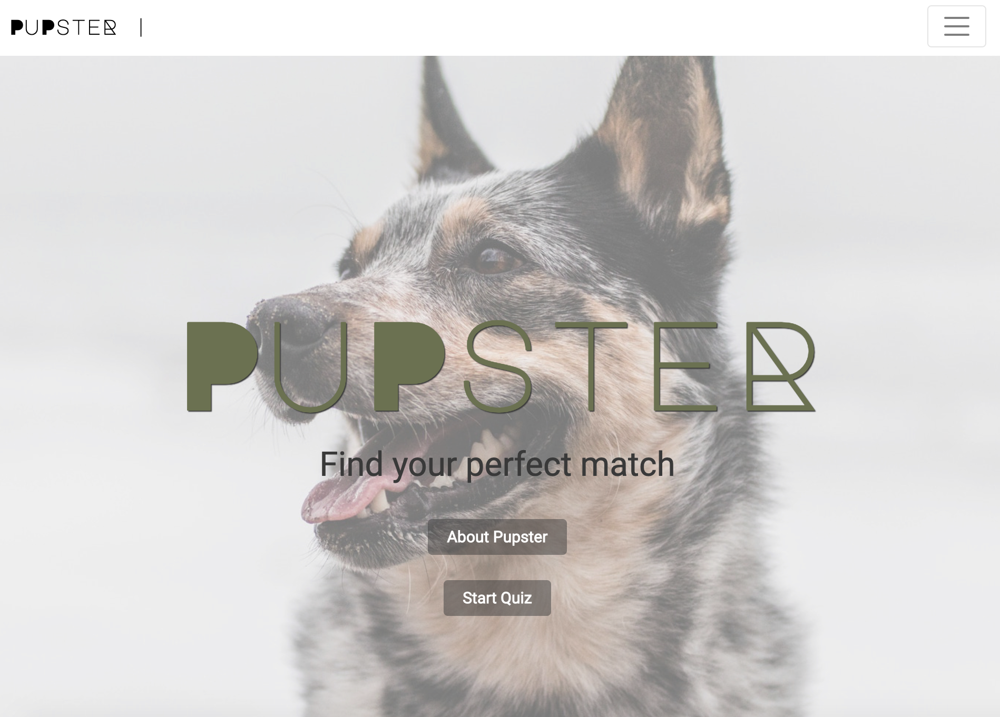
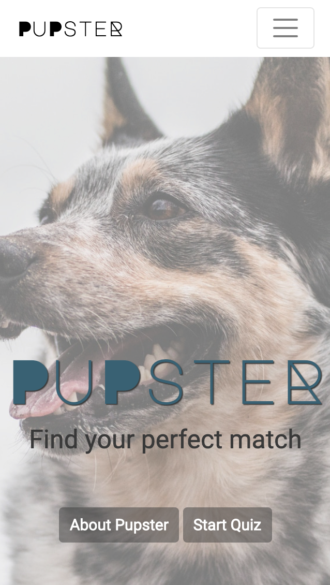
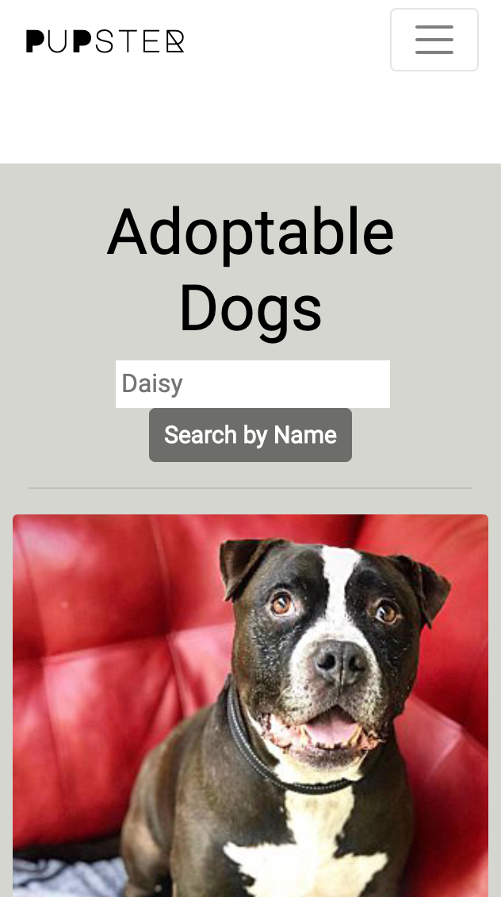

# _Pupster_

#### _A Web application that allows users to take a short quiz about their ideal type of dog to join their home, then matches them by percentage with local rescue dogs._

#### By _**Lindsey Baker, Kaya Jepson, Heather Zurek, Kerriann Walker**_

## Setup with importing SQL files

* _Clone this repo to your home machine_
* _Start MAMP_
* _Start Servers_
* _Click Open WebStart page_
* _On the webpage that opens, click Tools and choose PHPMYADMIN_
* _Create new database named pupster_
* _Select the Import tab_
* _Select the pupster.sql file and click Go_
* _Navigate the terminal to the Pupster.Solution directory_
* _enter $ dotnet run_
* _Open browser to localhost:5000 to use the app_

## Setup Database Instructions

* _Open terminal_
* _Run mysql -uroot -proot_
* _CREATE DATABASE 'pupster'_
<!-- *_Create table Instructions here_ -->

## Known Bugs

_No Known Bugs🐛🐞_

## Support and contact details

_If you have any questions or concerns please contact me at Heather.Zurek@gmail.com_

## Technologies Used

_C#, SQL, HTML, CSS, BOOTSTRAP_

### License

*GPL*

Copyright (c) 2019 **Lindsey Baker, Kaya Jepson, Heather Zurek, Kerriann Walker**
